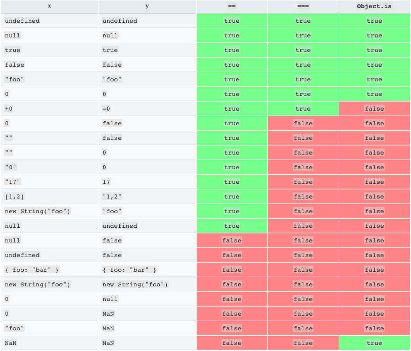

给定两个字符串 s 和 t ，编写一个函数来判断 t 是否是 s 的字母异位词。

示例  1:

```
输入: s = "anagram", t = "nagaram"
输出: true
```

示例 2:

```
输入: s = "rat", t = "car"
输出: false
```

说明:
你可以假设字符串只包含小写字母。

---

<font color='red'>
[ 'a', 'a', 'a', 'g', 'm', 'n', 'r' ] === [ 'a', 'a', 'a', 'g', 'm', 'n', 'r' ]
为false

'a,a,a,g,m,n,r' === 'a,a,a,g,m,n,r'
为 true

引用类型的 === 比较的是堆内存地址
</font>


